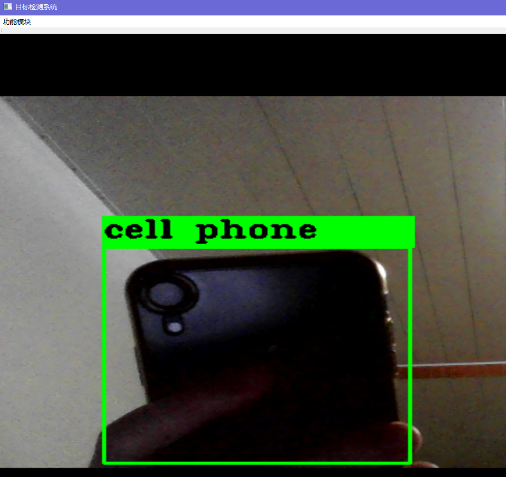

# Yolov4-QtGUI

- Yolov4-QtGUI是用QT和OpenCV开发可视化目标检测界面,可简便选择本地图片、摄像头来展示图像算法(深度学习、传统)处理结果
## 开发软件环境
- Windows 10
- QT 5.9
- OpenCV 3.3.0
- Visual Studio 2017
- Cuda 10.1
- Cudnn >= 7.0
## 使用步骤
- clone项目及软件安装（请参照博客：[Yolov4-QtGUI项目详解](https://blog.csdn.net/weixin_42448226/article/details/105752224) ）
  - download code：git clone https://github.com/AlexeyAB/darknet.git
  - download code：git clone https://github.com/scutlrr/Yolov4-QtGUI.git
  - 安装QT，且在VS上配置QT
- 编译
  - 用VS 打开项目，进入属性管理器，选择**release**模式下的配置文件opencv3.props修改自己opencv的include lib路径
- 修改QtGuiDemo.h文件中配置文件（names、cfg）、权重文件（yolov4.weight）路径

- 接入图像处理算法
  - 接入图像处理算法可以通过处理this->inputImage输出结果显示在this->imageLabel控件上
  - 本地图片处理：void openPictureSlot()，在这个槽函数处理this->imputImage
  - 视频文件和本地摄像头处理：void paintEvent(QPaintEvent *e)，在这个槽函数处理每一帧this->imageLabel
  - 本界面只有一个菜单栏功能模块和一个QLabel来显示检测结果

## 结果展示

- 测试图片：

- 测试摄像头：

